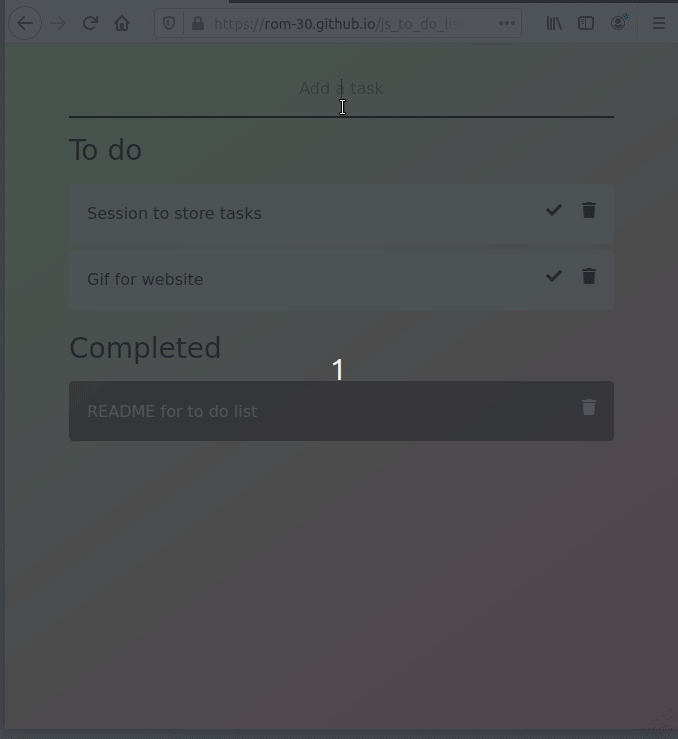

# To do list



[https://rom-30.github.io/js_to_do_list](https://rom-30.github.io/js_to_do_list/)
[Download the project](https://github.com/rom-30/js_to_do_list/archive/master.zip) or clone it

```bash
$ git clone git@github.com:rom-30/js_to_do_list.git
```

## Description
[Bootstrap](https://getbootstrap.com/) -  Free and open-source CSS framework
[Font Awesome](https://fontawesome.com/) - Vector icons and social logos
[jQuery](https://jquery.com/) - The Write Less, Do More, JavaScript Library